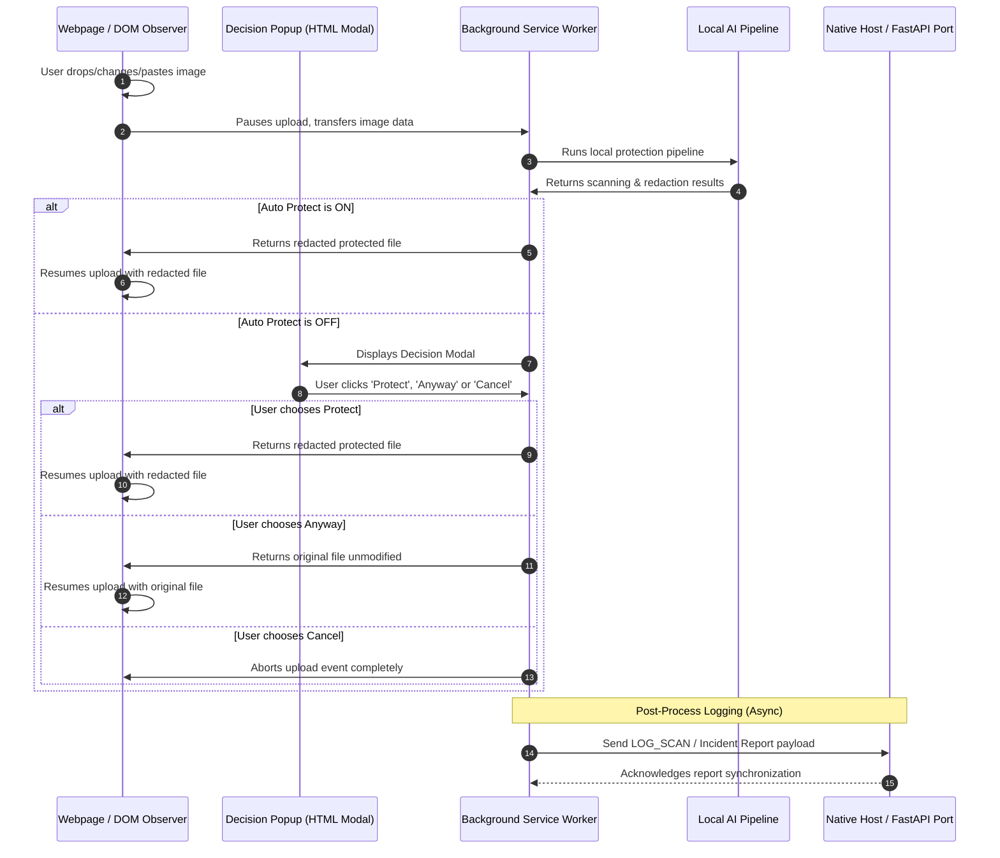

# SafeLens — Extension to Backend Integration Contract

This document specifies the communication protocols, payload formats, and lifecycle events required to integrate the SafeLens Chrome Extension with the backend services (FastAPI server / Native Messaging Host).

---

## 1. Integration Sequence Diagram

The diagram below details the end-to-end communication sequence during upload interception:



---

## 2. Communication Channels & Protocols

### A. Chrome Runtime Messaging Protocol
Internal communication between content scripts, the decision modal popup, and the background Service Worker is handled using `chrome.runtime.sendMessage` and `chrome.runtime.onMessage`.

*   **Format**: JSON object matching `SafeLensMessage`.
*   **Response**: Async response promise resolving to `SafeLensResponse`.

### B. Backend API / Native Messaging Protocol
For connecting with native hosts or web endpoints, SafeLens utilizes standard `fetch` HTTP POST requests.

*   **URL Endpoint**: `https://safelens-zttx.onrender.com/api/v1/scans` (or native port bindings).
*   **Payload Encoding**: JSON or `multipart/form-data`.
*   **Default Timeout**: `5000ms`.

---

## 3. API Schemas & Payloads

### A. Incident Report Sync Payload (`LOG_SCAN`)
Sent immediately after a scan finishes to populate the local history dashboard.

*   **HTTP Route**: `POST /api/v1/scans/log`
*   **Request Type**: `application/json`
*   **Payload Schema**:
```json
{
  "scanId": "scan_1719948010123_a9b8c7d6e",
  "fileName": "passport_copy.png",
  "size": 254890,
  "riskLevel": "high",
  "confidence": 0.94,
  "piiCount": 2,
  "processingTime": 240,
  "status": "protected",
  "detections": [
    {
      "type": "PASSPORT",
      "value": "A1234567",
      "ocrConfidence": 0.95,
      "regexConfidence": 0.90,
      "fusedConfidence": 0.935,
      "severity": "high",
      "bboxes": [
        {
          "x": 45,
          "y": 120,
          "width": 120,
          "height": 25,
          "confidence": 95
        }
      ],
      "source": "regex"
    }
  ]
}
```
*   **Expected Response (201 Created)**:
```json
{
  "success": true,
  "scanId": "scan_1719948010123_a9b8c7d6e",
  "syncedAt": "2026-07-10T16:00:00Z"
}
```

### B. Binary Image Submission (For optional cloud processing / logging)
*   **HTTP Route**: `POST /api/v1/scans/upload`
*   **Request Type**: `multipart/form-data`
*   **Form Parameters**:
    - `file`: Binary file blob
    - `phash`: Perceptual hash string (16-char hex)
    - `whash`: Wavelet hash string (16-char hex)
    - `riskLevel`: Low / Medium / High / Critical
*   **Payload Schema**:
```json
{
  "success": true,
  "fileUrl": "https://safelens-zttx.onrender.com/uploads/secured_scan_abc123.png",
  "fingerprint": {
    "phash": "9700008000800080",
    "whash": "ffffffffffffffff"
  }
}
```

---

## 4. Sub-Component Schemas

### A. Fingerprint Schema
Used to verify and search historical image hashes in database indexes.
```json
{
  "phash": "9700008000800080",
  "whash": "ffffffffffffffff"
}
```

### B. Detection Schema
Identifies specific intercepted PII details within the scanned image text.
```json
{
  "type": "EMAIL" | "PHONE" | "AADHAAR" | "PAN" | "PASSPORT" | "DRIVING_LICENSE" | "IFSC" | "CREDIT_CARD" | "UPI_ID" | "AWS_ACCESS_KEY" | "GOOGLE_API_KEY" | "GITHUB_PAT" | "JWT_TOKEN" | "PASSWORD_PATTERNS",
  "value": "string (the matched text)",
  "ocrConfidence": "number (0.0 to 1.0)",
  "regexConfidence": "number (0.0 to 1.0)",
  "fusedConfidence": "number (0.0 to 1.0)",
  "severity": "low" | "medium" | "high" | "critical",
  "bboxes": [
    {
      "x": "number",
      "y": "number",
      "width": "number",
      "height": "number",
      "confidence": "number (0-100)"
    }
  ],
  "source": "regex"
}
```

### C. Settings Schema
Configures the local protection filter values.
```json
{
  "protectionEnabled": "boolean",
  "riskLevelThreshold": "low" | "medium" | "high",
  "autoRedact": "boolean",
  "autoProtect": "boolean",
  "watermarkEnabled": "boolean",
  "aiCloakEnabled": "boolean",
  "allowedDomains": "string[]",
  "blurMode": "redact" | "blur" | "pixelate"
}
```

---

## 5. Resiliency, Errors & Retries

### A. Incident Report Retry Strategy
If the backend dashboard server is offline (e.g. `POST /scans/log` fails), the background Service Worker will fallback to queue-based persistence:
1. Store the unsynced scan result object in local storage under `chrome.storage.local` key `unsynced_scans`.
2. Attempt retry dispatches every **30 seconds** (up to **5 times**).
3. If still failing, drop the sync request but retain the local history record in storage to prevent memory overflow.

### B. Timeout Behavior
All network POST sync requests have a timeout boundary of **5000ms**. If no response is received, the request is aborted and added to the retry queue.

---

## 6. Compatibility matrix
*   **Extension Manifest Version**: Manifest V3
*   **Service Worker Engine**: ES Module (Chrome 118+)
*   **FastAPI Endpoint Support**: HTTP/1.1 or HTTP/2
